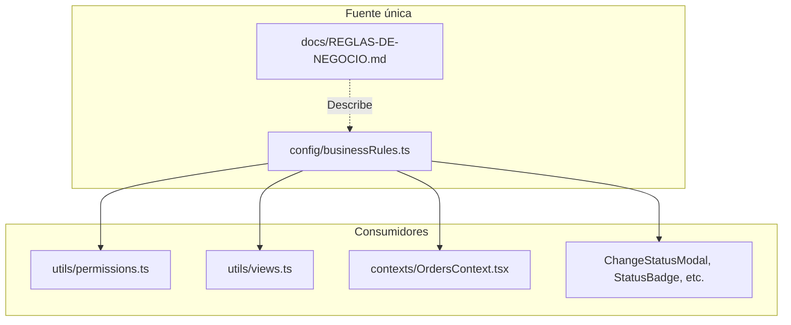

# Plan: Centralizar documentación de negocio dispersa

## Contexto del problema

La brecha 2.3 del [ANALISIS-Y-PLAN-METACOGNITIVO.md](docs/ANALISIS-Y-PLAN-METACOGNITIVO.md) indica que las **reglas de estados, permisos y flujos** están dispersas en múltiples archivos, lo que genera:

- Mantenimiento costoso (cambios en varios sitios)
- Onboarding difícil (no hay un único lugar de referencia)
- Riesgo de inconsistencia entre código y documentación

## Fuentes actuales de dispersión (mapeo)

| Tipo de regla                                  | Ubicaciones actuales                                                                                                                                                                                            |
| ---------------------------------------------- | --------------------------------------------------------------------------------------------------------------------------------------------------------------------------------------------------------------- |
| **Estados del pedido**                         | [types.ts](types.ts) (enum), [ChangeStatusModal.tsx](components/ChangeStatusModal.tsx), [StatusBadge.tsx](components/StatusBadge.tsx) (colores duplicados), [EditOrderModal.tsx](components/EditOrderModal.tsx) |
| **Permisos por acción**                        | [utils/permissions.ts](utils/permissions.ts) (crear/editar/eliminar/cambiar estado/checkboxes)                                                                                                                  |
| **Permisos por vista**                         | [utils/views.ts](utils/views.ts) (VIEW_MATRIX, rutas por defecto)                                                                                                                                               |
| **Regla KG/peso**                              | [OrdersContext.tsx](contexts/OrdersContext.tsx) (`hasUnweighedKGProducts`), [OrderDetail.tsx](views/OrderDetail.tsx), [Orders.tsx](views/Orders.tsx) (interceptan cambio a Pendiente Facturación)               |
| **Transiciones de estado por rol**             | [utils/permissions.ts](utils/permissions.ts) (`canChangeStatus`, `getAvailableStatusTransitions`)                                                                                                               |
| **Checkboxes (Logística, Facturación, Admin)** | [types.ts](types.ts) (comentarios), [utils/permissions.ts](utils/permissions.ts) (permisos), [OrderDetail.tsx](views/OrderDetail.tsx) (títulos tooltip)                                                         |
| **Totales (estimado vs real)**                 | [OrdersContext.tsx](contexts/OrdersContext.tsx) (`calculateEstimatedTotal`, `calculateActualTotal`)                                                                                                             |

---

## Arquitectura propuesta

**Principio**: Un módulo `config/businessRules.ts` será la **fuente única de verdad** en código. Un documento `docs/REGLAS-DE-NEGOCIO.md` describirá las reglas para humanos (onboarding, mantenimiento).

---

## Entregables

### 1. Documento maestro para humanos: `docs/REGLAS-DE-NEGOCIO.md`

Documento orientado a onboarding y mantenimiento que incluirá:

- **Estados del pedido**: lista, orden y significado de cada uno
- **Flujo de transiciones**: diagrama Mermaid (ya existe en el análisis) + tabla por rol
- **Matriz de permisos por acción**: crear, editar, eliminar pedido; cambiar estado; checkboxes
- **Matriz de vistas por rol**: qué ve cada rol
- **Reglas de validación**: productos KG exigen peso antes de Pendiente de Facturación; total estimado vs real
- **Checkboxes**: significado de Logística, Facturación, Admin y quién puede usarlos

### 2. Módulo centralizado: `config/businessRules.ts`

Archivo que exporta constantes y funciones derivadas:

- `ORDER_STATUSES`: array ordenado de estados (para evitar hardcodear en varios componentes)
- `STATUS_COLORS`: mapeo estado → clases CSS (eliminar duplicación en ChangeStatusModal y StatusBadge)
- `STATUS_TRANSITIONS_BY_ROLE`: matriz de transiciones permitidas (Logística, Facturación, Admin)
- `PERMISSIONS_MATRIX`: permisos por acción (crear, editar, eliminar, checkboxes)
- `VIEW_MATRIX`: vistas por rol (extraer de views.ts)
- `DEFAULT_ROUTES_BY_ROLE`: ruta por defecto por rol
- `VALIDATION_RULES`: funciones o constantes para "KG requiere peso antes de Pendiente Facturación"

### 3. Refactorización de consumidores

| Archivo                                                              | Cambio                                                                                                                            |
| -------------------------------------------------------------------- | --------------------------------------------------------------------------------------------------------------------------------- |
| [utils/permissions.ts](utils/permissions.ts)                         | Importar matrices desde `businessRules`; mantener la API pública actual para no romper `usePermissions`                           |
| [utils/views.ts](utils/views.ts)                                     | Importar VIEW_MATRIX y DEFAULT_ROUTES desde `businessRules`                                                                       |
| [contexts/OrdersContext.tsx](contexts/OrdersContext.tsx)             | Importar regla de validación KG (o constante) desde `businessRules`; mantener `hasUnweighedKGProducts` como wrapper si hace falta |
| [components/ChangeStatusModal.tsx](components/ChangeStatusModal.tsx) | Usar `STATUS_COLORS` desde `businessRules`                                                                                        |
| [components/StatusBadge.tsx](components/StatusBadge.tsx)             | Usar `STATUS_COLORS` desde `businessRules`                                                                                        |
| [components/EditOrderModal.tsx](components/EditOrderModal.tsx)       | Usar `ORDER_STATUSES` para opciones del dropdown (si aplica)                                                                      |

### 4. Actualización del análisis

- Actualizar [docs/ANALISIS-Y-PLAN-METACOGNITIVO.md](docs/ANALISIS-Y-PLAN-METACOGNITIVO.md) sección 1.4 "Componentes implícitos" para indicar que las reglas están ahora centralizadas
- Añadir referencia al nuevo `docs/REGLAS-DE-NEGOCIO.md` en la sección de entregables F1
- Marcar la brecha 2.3 como mitigada (o en progreso) en el registro de cambios

---

## Criterios de validación (F1)

- Todas las reglas de estados, permisos y flujos están descritas en `docs/REGLAS-DE-NEGOCIO.md`
- El código consume desde `config/businessRules.ts` (o equivalente)
- No hay duplicación de definiciones (ej. colores de estados solo en un lugar)
- El documento de análisis referencia el nuevo artefacto
- La aplicación sigue comportándose igual (regresión manual o exploratoria)

---

## Consideraciones

- **Retrocompatibilidad**: `permissions.ts` y `views.ts` conservan su API pública; el cambio es interno (origen de datos)
- **Tipos**: `OrderStatus` y `UserRole` en [types.ts](types.ts) se mantienen; `businessRules` los importa
- **Extensibilidad**: Añadir un rol o estado futuro requerirá editar principalmente `businessRules.ts` y el documento de reglas

---

## Orden de implementación sugerido

1. Crear `config/businessRules.ts` con las constantes y matrices extraídas
2. Crear `docs/REGLAS-DE-NEGOCIO.md` con el contenido para humanos
3. Refactorizar `permissions.ts` y `views.ts` para consumir `businessRules`
4. Refactorizar `OrdersContext` y componentes (StatusBadge, ChangeStatusModal) para usar `STATUS_COLORS` y reglas de validación
5. Actualizar `docs/ANALISIS-Y-PLAN-METACOGNITIVO.md` y registrar el cambio

