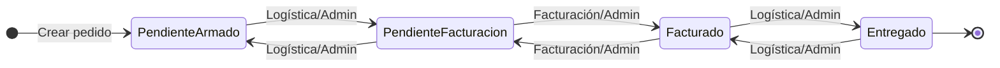

# Análisis y plan de acción con enfoque metacognitivo

**Última actualización:** 5 de febrero de 2025

Documento vivo de seguimiento del sistema de seguimiento de pedidos: análisis del sistema, relevamiento de estado actual, diseño del enfoque metacognitivo (curso/formación) y plan de acción en fases.

---

## 1. Análisis del sistema

### 1.1 Descripción como totalidad

El sistema es una **plataforma administrativa** para la gestión de productos, clientes, pedidos diarios, usuarios e historial de auditoría, en un contexto tipo distribuidora (DistriCladera). No existe en el codebase un módulo de curso ni contenido pedagógico para usuarios; el razonamiento metacognitivo está definido en el proceso de desarrollo (reglas en `.cursor/rules/metacognitive-reasoning.mdc`). Este documento trata el sistema actual como objeto de análisis y propone el curso/componente formativo como parte del estado deseado y del plan de acción.

| Dimensión | Descripción |
|-----------|-------------|
| **Objetivos** | Gestión de pedidos diarios, catálogo de productos, cartera de clientes, usuarios por rol, trazabilidad de acciones (auditoría). |
| **Actores** | Admin, Vendedor, Logística, Facturación (definidos en `types.ts`, matriz en `utils/views.ts`). |
| **Flujo de acceso** | Login por selección de usuario (desde `constants.tsx`) → rutas protegidas por rol (`ProtectedRoute`, `ViewGuard`) → vistas según permisos: Dashboard, Productos, Clientes, Pedidos, Detalle de pedido, Usuarios (solo Admin), Auditoría (solo Admin). |
| **Flujo de pedido** | Estados: Pendiente de Armado → Pendiente de Facturación → Facturado → Entregado. Transiciones restringidas por rol (`utils/permissions.ts`). Productos por KG exigen peso real antes de pasar a Pendiente de Facturación (`OrderDetail`, `OrdersContext`). |

### 1.2 Flujo de estados del pedido y actores

**Actores y vistas permitidas:**

| Rol | Dashboard | Productos | Clientes | Pedidos | Usuarios | Auditoría |
|-----|-----------|-----------|----------|---------|----------|-----------|
| Admin | Sí | Sí | Sí | Sí | Sí | Sí |
| Vendedor | Sí | Sí | Sí | Sí | No | No |
| Logística | No | No | No | Sí | No | No |
| Facturación | Sí | Sí | Sí | Sí | No | No |

### 1.3 Componentes explícitos

| Componente | Ubicación | Función |
|------------|-----------|---------|
| Vistas | `views/` | Login, Dashboard, Products, Clients, Orders, OrderDetail, Users, Audit. |
| Componentes UI | `components/` | Modales (pedido, cliente, producto, usuario, pesos, observaciones, cambio de estado), Header, Sidebar, StatusBadge, ProtectedRoute, ViewGuard. |
| Contextos | `contexts/` | Auth, Orders, Products, Clients, Users, Audit. Estado global vía Context API. |
| Hooks | `hooks/` | useAuth, usePermissions. |
| Permisos y vistas | `utils/permissions.ts`, `utils/views.ts` | Matriz de permisos por acción (crear/editar/eliminar pedido, cambiar estado, checkboxes por área) y por vista. |
| Tipos | `types.ts` | Order, OrderStatus, OrderItem, Product, Client, User, UserRole, AuditEntry. |
| Utilidades | `utils/csvExport.ts` | Exportación a CSV. |

### 1.4 Componentes implícitos

| Componente | Situación actual |
|------------|------------------|
| **Persistencia** | No hay backend ni persistencia de pedidos, productos, clientes ni auditoría. Solo auth usa `localStorage` y se limpia al cargar (`AuthContext`). Los datos viven en estado React (`INITIAL_ORDERS`, etc. en `constants.tsx`). |
| **API externa** | `GEMINI_API_KEY` en `vite.config.ts`; no se usa en la lógica de negocio. |
| **Criterios de negocio** | Reglas de total estimado vs total real (solo Unidad en estimado; KG con peso en real), flujo de checkboxes (logística / facturación / admin) no están documentados en un único lugar. |

### 1.5 Supuestos y restricciones

- Datos de arranque en memoria; recarga de página pierde cambios en pedidos, productos, clientes y auditoría.
- Sesión de auth sin persistencia útil (localStorage se borra al iniciar).
- README orientado a "AI Studio app" y Gemini, desalineado con el dominio actual (seguimiento de pedidos).

### 1.6 Decisiones no validadas

- Si habrá persistencia (backend o capa local) y cuándo.
- Público objetivo real: solo uso interno vs exposición a clientes.
- Uso previsto de Gemini en el producto (si aplica).

---

## 2. Relevamiento

### 2.1 Estado actual

| Aspecto | Detalle |
|---------|---------|
| **Stack** | React, Vite, Tailwind, React Router. Estado global vía Context API. TypeScript con tipos en `types.ts`. |
| **Funcionalidad** | ABM de pedidos, productos, clientes, usuarios; detalle de pedido con cambio de estado, ingreso de pesos para KG, observaciones de cliente y pedido, checkboxes por rol (logística, facturación, admin); auditoría en memoria; export CSV; permisos por vista y por acción. |

### 2.2 Capacidades disponibles

| Tipo | Situación |
|------|-----------|
| **Técnicas** | Frontend SPA completo; permisos y roles consistentes; auditoría de acciones en memoria. |
| **Pedagógicas** | Solo en proceso de desarrollo (reglas metacognitivas en `.cursor`). No hay onboarding ni ayuda contextual en la UI. |
| **Contenido** | Datos de ejemplo en `constants.tsx`; no hay manuales ni guías dentro del producto. |

### 2.3 Brechas (estado actual vs deseado)

| Brecha | Impacto | Prioridad |
|--------|---------|-----------|
| Sin persistencia de pedidos, productos, clientes ni auditoría | Pérdida de datos al recargar; imposibilidad de uso serio en producción. | Alta |
| Curso/formación inexistente | Usuarios no tienen apoyo para aprender a usar el sistema ni para autorregular su aprendizaje. | Media–Alta |
| Documentación de negocio dispersa | Reglas de estados, permisos y flujos no están en un solo lugar; mantenimiento y onboarding costosos. | Alta |
| README genérico (AI Studio / Gemini) | Confusión sobre el propósito real del proyecto. | Media |

### 2.4 Riesgos cognitivos

| Riesgo | Señal observable | Mitigación propuesta |
|--------|------------------|----------------------|
| Sobrecarga | Muchos estados y permisos por rol sin guía en pantalla. | Tooltips, microcopy y/o checklist "Antes de facturar"; documentación in-app o guía rápida por rol. |
| Ambigüedad | Duda sobre cuándo usar cada estado y qué hace cada checkbox. | Etiquetas claras, ayuda contextual en estados y en checkboxes (logística / facturación / admin). |
| Falta de feedback | Errores vía `alert`; sin confirmaciones ni mensajes de éxito consistentes. | Mensajes claros de éxito/error; toasts o banners de confirmación. |
| Sin soporte para monitoreo del aprendizaje | No hay reflexión guiada ni autoevaluación en la herramienta. | Curso o módulo formativo con preguntas de reflexión y criterios de "sé que lo logré"; uso de auditoría como evidencia. |

---

## 3. Enfoque metacognitivo

El curso o componente formativo (estado deseado) debe fomentar conciencia del proceso de aprendizaje, planificación/monitoreo y evaluación, y transferencia a nuevos contextos. A continuación se detalla por dimensión y se proponen métricas observables.

### 3.1 Conciencia del propio proceso de aprendizaje

- **Objetivos por rol**: Definir qué debe poder hacer cada rol al terminar la formación y criterios de "sé que lo logré".
- **Preguntas de reflexión**: Tras tareas clave (por ejemplo cambiar estado, facturar, marcar ítems listos), incluir preguntas como: "¿Qué pasos seguiste para cambiar el estado?" o "¿En qué momento verificaste los pesos KG?".
- **Criterios explícitos**: Comunicar qué se considera bien hecho (ej. "Todos los ítems KG con peso antes de pasar a Pendiente de Facturación").

### 3.2 Planificación, monitoreo y evaluación

- **Checklist antes de facturar**: Verificar pesos KG, ítems listos por logística, totales coherentes.
- **Autoevaluación corta**: Preguntas como "¿Revisaste los totales antes de confirmar?".
- **Uso de la auditoría**: Enseñar a usar el historial de auditoría como evidencia de lo realizado y como apoyo al monitoreo posterior.

### 3.3 Transferencia a nuevos contextos

- **Ejercicios en contexto**: Pedidos de ejemplo con variaciones (solo Unidad, solo KG, mixtos).
- **Preguntas de transferencia**: "¿Qué harías si el pedido fuera mixto KG/Unidad?"; "¿Qué rol debe actuar en cada transición?".
- **Guía de decisión por rol**: Tabla o flujo que resuma qué puede hacer cada rol en cada estado.

### 3.4 Métricas o señales observables de metacognición

| Métrica | Qué mide | Cómo se obtiene |
|---------|----------|------------------|
| Uso de ayudas/checklists antes de acciones críticas | Si el usuario planifica antes de actuar. | Eventos de uso de checklist o ayuda (si se implementan). |
| Respuestas a preguntas de reflexión | Nivel de conciencia del proceso. | Módulo de curso con respuestas guardadas (si se implementa). |
| Tiempo y precisión en tareas de transferencia | Aplicación en contextos nuevos. | Tiempo y aciertos en ejercicios con pedidos con variaciones. |
| Consultas a auditoría tras acciones | Verificación posterior (monitoreo). | Eventos de visita a vista Auditoría tras cambio de estado o facturación. |

---

## 4. Plan de acción

### 4.1 Fases secuenciales

| Fase | Objetivo | Entregables | Criterios de validación | Dependencias |
|------|----------|-------------|--------------------------|--------------|
| **F1** | Estabilizar y documentar el sistema actual | Documento de arquitectura y reglas de negocio (estados, permisos, flujos); este mismo .md como archivo vivo | Reglas de negocio trazables al código; documento actualizado con estado actual | Ninguna |
| **F2** | Reducir riesgos cognitivos en la UI | Mensajes claros de éxito/error, tooltips o microcopy en estados y checkboxes; opcional: checklist "Antes de facturar" | Usuario puede entender qué hace cada control sin documentación externa | F1 |
| **F3** | Definir y diseñar el curso/componente formativo | Especificación del curso (objetivos por rol, unidades, actividades metacognitivas, métricas); wireframes o flujo si es in-app | Objetivos medibles; al menos una métrica de metacognición por unidad | F1, F2 |
| **F4** | Implementar soporte de persistencia (si aplica) | Backend o capa de persistencia local; migración de datos de ejemplo | Pedidos y auditoría sobreviven a recarga; criterios de integridad definidos | F1 |
| **F5** | Implementar curso o primer piloto | Módulo de formación (in-app o externo), contenido y al menos un ciclo de reflexión/autoevaluación | Al menos un flujo completo "aprender → reflexionar → aplicar" por rol piloto | F3; opcional F4 |

### 4.2 Dependencias y prioridades

- **F1 y F2** son la base: documentación y mejora de UX deben ir primero.
- **F3** (diseño del curso) puede avanzar en paralelo conceptual con F2.
- **F4** (persistencia) depende de la decisión de arquitectura y recursos; no bloquea F3 ni F5 desde el punto de vista del diseño del curso.
- **F5** (implementación del curso) debe ejecutarse después de F3; puede realizarse con o sin F4 según si el curso es in-app o externo.

---

## 5. Autocrítica y ajuste

### 5.1 Limitaciones del plan

- No existen requisitos formales de negocio ni priorización con stakeholders; el "estado deseado" se infiere del análisis del código y de las reglas de desarrollo.
- Las fases F4 (persistencia) y F3–F5 (curso) pueden depender de recursos y plazos no conocidos.
- Las métricas de metacognición requieren instrumentación (eventos, respuestas) que hoy no existe en el producto.

### 5.2 Información adicional ideal

- Prioridad de negocio: persistencia vs. formación vs. más roles o flujos.
- Si el curso será in-app, solo onboarding o recurso permanente.
- Existencia de backend o API prevista; restricciones de hosting y datos.

### 5.3 Qué revisar primero si el proyecto cambia

| Cambio | Acción recomendada |
|--------|---------------------|
| Se añade backend/API | Actualizar F4 y la sección de análisis (flujo de datos); revisar impacto en auditoría y permisos. |
| Se prioriza otro rol o flujo | Reordenar F2 (UX por rol) y F3 (unidades del curso por rol). |
| Se abandona la idea de curso | Mantener F1, F2 y F4; documentar en este .md que el enfoque metacognitivo queda en proceso de desarrollo (reglas .cursor) y en mejoras de UX (feedback, claridad). |

---

## 6. Registro de cambios

| Fecha | Cambio | Autor |
|-------|--------|-------|
| 2025-02-05 | Creación del documento: análisis del sistema, relevamiento, enfoque metacognitivo, plan de acción en fases, autocrítica y registro de cambios. | Plan implementado |
