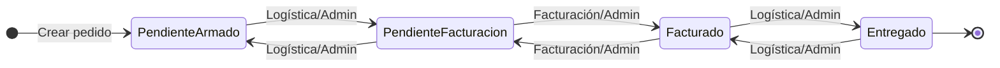

# Reglas de Negocio

**Última actualización:** 6 de febrero de 2025

Documento maestro de reglas de negocio para onboarding y mantenimiento. La implementación técnica está centralizada en `config/businessRules.ts`.

---

## 1. Estados del pedido

| Estado | Orden | Significado |
|--------|-------|-------------|
| **Pendiente de Armado** | 1 | Pedido creado; logística prepara los productos. |
| **Pendiente de Facturación** | 2 | Listo para facturar; todos los productos KG deben tener peso real. |
| **Facturado** | 3 | Pedido facturado por el área de facturación. |
| **Entregado** | 4 | Pedido entregado al cliente. |

---

## 2. Flujo de transiciones

### Transiciones permitidas por rol

| Rol | Transiciones |
|-----|--------------|
| **Admin** | Cualquier transición entre estados. |
| **Vendedor** | Ninguna (no puede cambiar estado). |
| **Logística** | Pendiente Armado ↔ Pendiente Facturación; Facturado ↔ Entregado. |
| **Facturación** | Pendiente Facturación ↔ Facturado. |

---

## 3. Matriz de permisos por acción

### Pedidos

| Acción | Admin | Vendedor | Logística | Facturación |
|--------|-------|----------|-----------|-------------|
| Crear pedido | Sí | Sí | No | Sí |
| Editar pedido (no facturado ni entregado) | Sí | Sí | Sí | No |
| Eliminar pedido (no facturado ni entregado) | Sí | Sí | No | No |
| Cambiar estado | Sí (cualquier) | No | Según tabla anterior | Según tabla anterior |

### Checkboxes en detalle de pedido

| Checkbox | Significado | Quién puede usarlo |
|----------|-------------|---------------------|
| **Log.** (Logística) | Artículo listo/completado por logística. | Logística, Admin |
| **Fact.** (Facturación) | Artículo facturado. | Facturación, Admin |
| **Admin** | Verificado por admin (coincide con lo facturado). | Solo Admin |

---

## 4. Matriz de vistas por rol

| Vista | Ruta | Admin | Vendedor | Logística | Facturación |
|-------|------|-------|----------|-----------|-------------|
| Panel General | `/` | Sí | Sí | No | Sí |
| Productos | `/productos` | Sí | Sí | No | Sí |
| Clientes | `/clientes` | Sí | Sí | No | Sí |
| Pedidos | `/pedidos` | Sí | Sí | Sí | Sí |
| Usuarios | `/usuarios` | Sí | No | No | No |
| Auditoría | `/auditoria` | Sí | No | No | No |

**Ruta por defecto:**
- Logística: `/pedidos` (solo tiene acceso a Pedidos).
- Resto: `/` (Panel General).

---

## 5. Reglas de validación

### Productos por KG y peso real

- **Regla:** No se puede pasar a **Pendiente de Facturación** si hay productos por KG sin peso real ingresado.
- **Comportamiento:** Al intentar cambiar a Pendiente de Facturación, se abre el modal de ingreso de pesos.
- **Total estimado:** Solo incluye productos por Unidad. Productos KG sin peso = $0.
- **Total real:** Incluye productos Unidad + productos KG con peso real.

### Totales

| Tipo | Fórmula |
|------|---------|
| Total estimado | Suma de (precio × cantidad) solo para productos por Unidad. |
| Total real | Suma de (precio × peso real) para KG + (precio × cantidad) para Unidad. |

---

## 6. Referencia técnica

| Artefacto | Ubicación |
|-----------|-----------|
| Implementación | `config/businessRules.ts` |
| Permisos (API) | `utils/permissions.ts` |
| Vistas (API) | `utils/views.ts` |
| Contexto de pedidos | `contexts/OrdersContext.tsx` |
